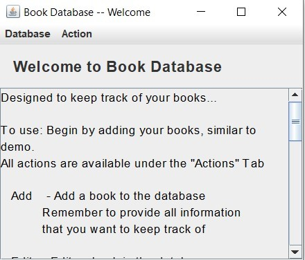

# Final Project – Book Database
Java
 
For the final project I designed a Java application using Java Swing GUI to contain books from my personal library and catalog whether I have loaned the books out or read them, and other functionality that I would like for my managing my books. The interface is straightforward, but I will discuss the pages and output here to give an explanation and help with use. 
The project uses serialized data in text files to hold the book lists, so that they do not get lost when the application closes down. If there are no files, I made a small demo which populates the database pages and displays example books. I’m including files that can be used to show the size/capability of the database pages as well.  
Welcome Page 
 
This is the Welcome page. I added a how-to for the user to direct them to which pages they might want to go to. The how-to explains how to add, edit, and remove books. There is also functionality to read a book, loan a book, or select a book. 

  
There are two parts to this application. The first includes tables and lists of books and keeps track of that functionality, while the second part provides actions for the user to add, edit, and maintain the databases.  
Here are output of some of that functionality. 
 
# Add a Book 
 
 Adding a book is the first step. The program will conduct a size and digit check on the date and ISBN numbers but the user could technically use all text fields however they please. If the user is cataloging their own books and doesn’t want to use the ISBN or publishing information, they can leave these fields blank. Only Title and Author are required fields and if they are empty a pop up error message will appear. 
  
 
# Edit a Book 
 
The next page is Edit and allows to user to search by Title and Author in order to edit the details. Then the book information available in the database will appear, allowing the user to edit the item and update the database. There is no current functionality for duplicate books, but this could be a future addition. 
  
  
 
You can continue to edit the note of a book by selecting edit note: 
 
  
# Remove a Book 
 
Removing a book is another important if a user gets rid of a book or wants to remove a demo book in their database. It works similar to the Editing pages, except that the values are not enabled (the user cannot edit them). Selecting “Confirm Remove” will remove the book from the database. 
  
 
Some other popup messages are added if a book cannot be found. 
 
  
 
 
 
 
# Loan/Return a Book 
 
As an action a user can “Loan”/“Return” a book. Adding the Loan a book feature was complicated because it required a list of “friends” to note who received books and what books friends currently hold. There is also a separate Loaned Books database to allow for easier management. To Loan a book, the program accepts input of Title and Author and friend’s name. It will search the database for friend’s name, add the friend if they do not exist, and add this information to the loaned book database. 
 
  
 
This is a display of the loaned book database page. If enough books are added to extend the page there is a scroll pane for the table. 
 
  
“Return” a book works similarly but will remove a person from the list unless they have two books: 
  
 
  
 
 
 
 
 
 
# Read a Book 
 
Another action is to “Read” a book. This will use Title and Author to find the book from the database and perform the action. The Read page allows a note, which isn’t displayed in the main database, but there is a separate page where the user can go back and read their notes and another to edit their notes. The books are also given a rating, which can be edited like any other field and are displayed in the Read table. Ratings need to be set to a value between 0.0 and 10.0, otherwise they won’t be added. 
  
Next I’ll show the read database: 
  
# Read Notes 
 
And the Notes item will show the notes for all the read books that have currently been filed. 
  
# Select a Book 
 
The Actions menu also includes “Select” which just selects a random book that has not been read from the main database and displays the book information. This is useful if you are not sure which book to choose and want to randomly select something from your personal library. This could be updated to include more options like already read books or a specific genre. For now, it just displays a “random” unread book (using Math.random() so I don’t assume it is entirely random). 
  
# View Bookshelf 
 
A user can access their entire bookshelf in the database by selecting “All” from the menu. I tried to put in enough info so that it will show the scroll pane object in the table. Also tables are not editable, due to the fact that any edit to the table would not be saved. 
  
 
# Conclusion 
 
A user can return to the Welcome page by selecting “Back”. 
And that is how to use the program. In my submission files, I included my personal library book files, but a new user would start with a demo and any number of books could be added and the program will create new files for the serialized data. 
